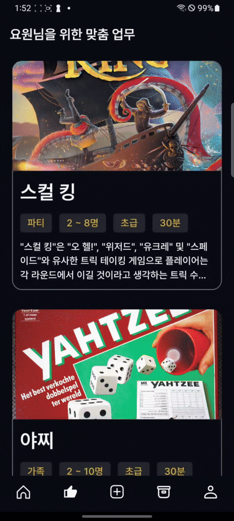
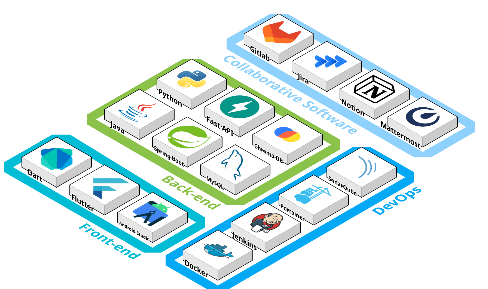
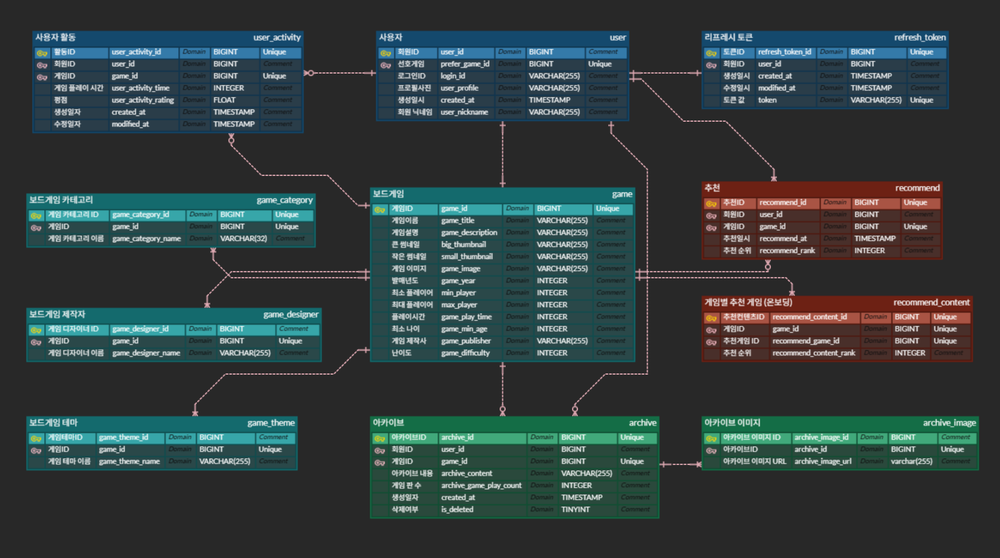

   
  
  <h1> James Board</h1>
   

## 목차

1. [**Jamesboard App 소개**](#1)
1. [**기술 스택**](#2)
1. [**주요 기능**](#3)
1. [**프로젝트 구성도**](#4)
1. [**영상 포트폴리오**](#5)
1. [**개발 팀 소개**](#6)
1. [**개발 기간 및 일정**](#7)

  

  

## 🕵️ Jamesboard App 소개

**James Board는** 온보딩 데이터, 사용자 리뷰데이터를 기반하여 보드게임을 추천해주는 서비스입니다.

추천 서비스는 보드게임 설명 및 보드게임 리뷰 데이터를 활용하여 콘텐츠 기반 필터링을 이후 사용자 리뷰 데이터가 많이 남은 경우에는 하이브리드 필터링을 진행합니다.

해당 프로젝트는 삼성청년SW아카데미 12기 2학기 특화 프로젝트 과정 중 구미캠퍼스에서 진행되었습니다.

  

  

## 🛠 기술 스택

### **AOS**

### **BackEnd**

### **DevOps**

### **협업도구**

  

  

## 📌 주요 기능

|                     **Login**                      |                        **onboarding**                        |                       
| :-----------------------------------------------------: | :---------------------------------------------------------: |
|  |  |  |

 

|                      **Home**                      |                      **Rating**                      |                       **Recommend**                      |
| :--------------------------------------------------------: | :---------------------------------------------------------: | :---------------------------------------------------------: |
|  |  |  |

 

|                      **Chatbot**                      |                      **Archive**                      |                       **MyInfo**                      |
| :--------------------------------------------------------: | :---------------------------------------------------------: | :---------------------------------------------------------: |
|  |  |  |

 

  

## 📁 프로젝트 구조

|                                    Architecture                                    |
| :--------------------------------------------------------------------------------: |
|  |

|                                    ERD                                    |
| :-----------------------------------------------------------------------: |
|  |

  

  

## 🎥 영상 포트폴리오

[**james board 영상 포트폴리오 바로가기**](https://youtu.be/LIxzq0-G3Dk)

  

  

## 🏅 개발 팀 소개

<table align="center">
  <tr>
    <td align="center" width="150px">
      
    </td>
    <td align="center" width="150px">
      
    </td>
    <td align="center" width="150px">
      
    </td>
    <td align="center" width="150px">
      
    </td>
    <td align="center" width="150px">
      
    </td>
    <td align="center" width="150px">
      
    </td>
  </tr>
  <tr>
    <td align="center">
        김두영 BE & DevOps
    </td>
    <td align="center">
        김동현 App & Data
    </td>
    <td align="center">
        강민석 BE & AI
    </td>
    <td align="center">
        김성현 App
    </td>
    <td align="center">
        박장훈 App
    </td>
    <td align="center">
        차현우 BE & Data
    </td>
  </tr>
</table>

  

  

## ⏰ 개발 기간 및 일정

### [2/24] PJT 1주차 시작 및 팀 구성

- Notion 생성
- Jira 생성
- Convention 설정 (Git, Code, Naming)
- Code Convention 설정
- 빅데이터 추천 서비스 기획

### [~3/9] PJT 2주차

- API 명세서 작성
- ERD 구성
- DevOps 구성
- 빅데이터 수집 및 전처리
- Spring 서버 구현
- 콘텐츠 기반 필터링 로직 구현
- App UI/UX 디자인
- [3/14] 전문가 1차 미팅

### [~3/16] PJT 3주차

- APP UI/UX 개발
- FastAPI 서버 구현
- 하이브리드 필터링 로직 구현
- [3/21] 중간 발표

### [~3/23] PJT 4주차

- Spring, FastAPI 서버 기능 개선
- App 기능 개선
- [3/28] 전문가 2차 미팅

### [~3/30] PJT 5주차

- App Widget 개발
- 빅데이터 로직 기능 개선
- 콘텐츠 기반 필터링 Bug Fix
- 하이브리드 필터링 Bug Fix

### [~4/6] PJT 6주차

- 영상 포트폴리오 작성
- AI 챗봇 시스템 구성 및 구현
- App Bug Fix

### [~4/11] PJT 7주차

- App Bug Fix
- [4/8] 1차 QA
- [4/9] 2차 QA
- [4/10] 3차 QA
- [4/11] 최종 발표

  
